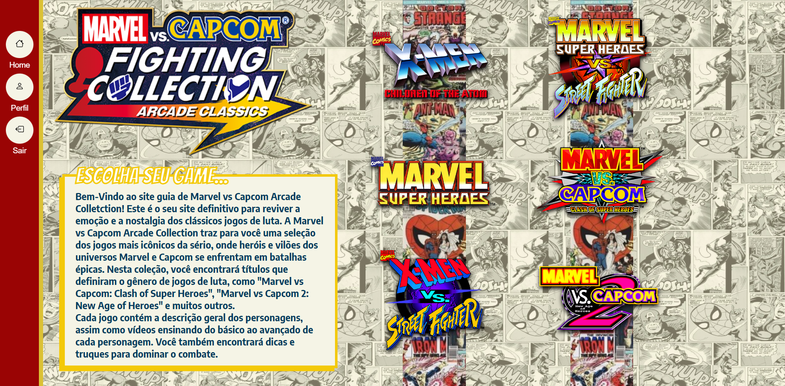
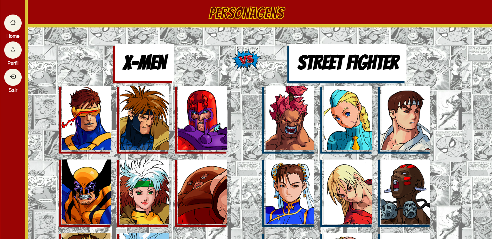
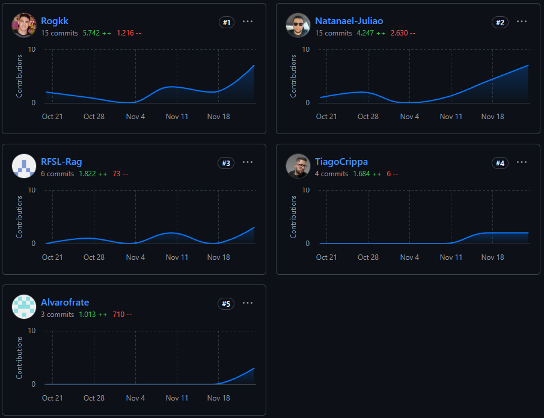

[HTML5]: https://img.shields.io/badge/html5-%23E34F26.svg?style=for-the-badge&logo=html5&logoColor=white
[CSS3]: https://img.shields.io/badge/css3-%231572B6.svg?style=for-the-badge&logo=css3&logoColor=white
[JavaScript]: https://img.shields.io/badge/javascript-%23323330.svg?style=for-the-badge&logo=javascript&logoColor=%23F7DF1E
[PHP]: https://img.shields.io/badge/php-%23777BB4.svg?style=for-the-badge&logo=php&logoColor=white
[MySQL]: https://img.shields.io/badge/mysql-4479A1.svg?style=for-the-badge&logo=mysql&logoColor=white

<h1 align="center" style="font-weight: bold;">Marvel Vs. Capcom - Trabalho Desenv. Web 🌐</h1>

![html5][HTML5]
![css][CSS3]
![javascript][JavaScript]
![php][PHP]
![sql][MySQL]

<p align="center">
    <b>O projeto consiste em um site demonstrativo que explora a coletânea de jogos Marvel Vs Capcom - Arcade Collection. A plataforma apresenta de forma interativa e organizada descrições, características, curiosidades, tutoriais e histórias de cada jogo e de seus personagens.</b>
</p>

<h2>🎨 Layout</h2>
<p align="center">
    
    
</p>

<h2>🛠 Com o que foi construído?</h2>
<p>A aplicação foi desenvolvida utilizando:</p>

- HTML5 para a estruturação das páginas.
- CSS3 para estilização e design responsivo.
- JS para interação de validação de dados e atualizações dinamicas em tempo real.
- PHP para manipulação do back-end e lógica de negócio.
- MySQL para o armazenamento dos dados dos usuários, e interações entre usuários.
  
<p>O projeto de interface e experiência do usuário foi planejado com ferramentas de design no Figma, garantindo um layout funcional e intuitivo. <a href="https://www.figma.com/design/aR7v08vv9jrvcXZF4Dsn4Z/MARVEL-VS-CAPCOM-FORUM?node-id=0-1&t=uMVhJv5dcsGwONl9-1">Link Figma</a></p>

<h2>⁉ Por que foi feito?</h2>
<p>O objetivo principal do site é oferecer uma plataforma onde fãs possam explorar detalhadamente os jogos e seus personagens, aprendendo por meio de tutoriais e curiosidades.</p>


<h2>🚀 Instruções</h2>
<h3>Ferramentas Necessárias</h3>
<p>Para que a aplicação funcione corretamente em sua máquina, é necessário:</p>

- Um ambiente de simulação de servidor, como o XAMPP, que integra o phpMyAdmin.
- Extensões do PHP atualizadas e compatíveis.
- O Git instalado para clonar o repositório.

<h3>Etapas para Configuração:</h3>

1. Clonar o repositório:
   - Abra o terminal ou prompt de comando.
   - Navegue até a pasta htdocs do XAMPP.
   - Execute o comando abaixo para clonar o repositório:

```bash
git clone https://github.com/Natanael-Juliao/Trabalho-Des.-Web
```

2. Importar o banco de dados:
   - Acesse o phpMyAdmin pelo navegador no endereço http://localhost/phpmyadmin.
   - Importe o arquivo SQL fornecido, que contém a estrutura e os dados necessários para as funcionalidades de cadastro, login, perfil e comentários.

3. Rodar o servidor e acessar o projeto:
   - Certifique-se de que o servidor Apache e o MySQL estão ativos no XAMPP.
   - No navegador, acesse o link:
http://localhost/Trabalho-Des.-Web/HTML/  

<h2>🤝 Colaboradores</h2>

Um agradecimento especial a todas as pessoas que contribuíram para este projeto.

<table>
  <tr>
    <td align="center">
      <a href="https://github.com/Natanael-Juliao">
        <br>
        <sub>
          <b>Natanael Julião</b>
        </sub>
      </a>
    </td>
    <td align="center">
      <a href="https://github.com/Rogkk">
        <br>
        <sub>
          <b>Rogério Silva</b>
        </sub>
      </a>
    </td>
    <td align="center">
      <a href="https://github.com/TiagoCrippa">
        <br>
        <sub>
          <b>Tiago Crippa</b>
        </sub>
      </a>
    </td>
    <td align="center">
      <a href="https://github.com/RFSL-Rag">
        <br>
        <sub>
          <b>Ronaldo</b>
        </sub>
      </a>
    </td>
    <td align="center">
      <a href="https://github.com/Alvarofrate">
        <br>
        <sub>
          <b>Alvaro Frate</b>
        </sub>
      </a>
    </td>
  </tr>
</table>

<h2>📃 Logs de Contribuição</h2>

### Natanael julião
- Função: Desenvolvedor Back-End e Front-End
- Contribuições:
  - Abertura do repositório e instruções de uso do Github aos colegas de grupo;
  - Abertura do OneDrive para salvar documentos em Nuvem;
  - Lógica de "imprimir" na tela os dados da tabela do banco de dados em PHP e MySQL;
  - Construção do Front-End das páginas de login e Cadastro;
  - Lógica da validação do Login em JS;
  - Construção da página X-Men Children of the Athon em HTML;
  - Estilização da página X-Men Children of the Athon em CSS;
  - Contribuição no script em JS, estilização em CSS e estrutura em HTML para os pop-ups;
 
### Rogério Silva
- Função: Desenvolvedor Back-End - UX/UI Designer
- Contribuições:
  - Criação do banco de dados e configuração do MySQL;
  - Lógica de Cadastro, Login e Perfil;
  - Integração do PHP com o front-end;
  - Contribuição no desenvolvimento da interface no Figma;
  - Contribuição com css.

### Tiago Crippa
- Função: Desenvolvedor Front End
- Contribuições:
  - Construção do script para os pop-up
  - Construção a página Marvel Super Heroes
  - Construção a página X-Men Vs Street-Fighter
 
### Alvaro Frate 
- Função: UX/UI Designer - Project Owner
- Contribuições:
  - Projeto Design Figma;
  - Descrições gerais de personagens e jogos;
  - Coletar links de trailers e tutorias de personagens;
  - Contribuição no HTML e CSS.

 ### Ronaldo
- Função: Front End
- Contribuições:
  - Contribuição em CSS
  - Desenvolvi a página Marvel vs Capcom: Clash of Heroes
 
<p align="center">
    
</p>
